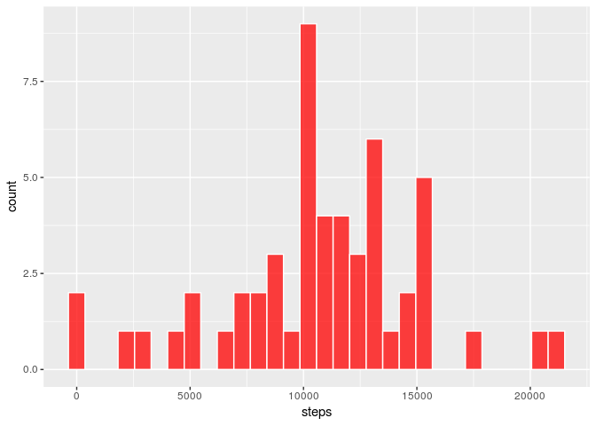
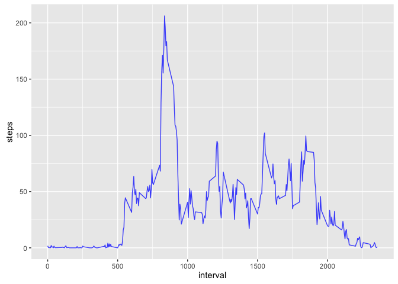

## Loading and preprocessing the data
Since the data file (activity.zip) is available in the repository, we will create the dataset statring from the .csv file that is inside
(if not present), furthermore, we will include the knitr library and the ggplo2 if necessary:


```r
## Setting up all code chunks according to the assignment specs
knitr::opts_chunk$set(
    eval = TRUE,
    echo = TRUE,
    tidy = TRUE,
    results = "markup",
    include = TRUE,
    message = FALSE,
    warning = FALSE,
    knitr.table.format = "markdown", 
    tidy.opts = list(width.cutoff = 80), 
    fig.align = "center", 
    fig.path = "figure/", 
    highlight = TRUE
)


if (!require(knitr)) {
    install.packages("knitr")
}
if (!require(ggplot2)) {
    install.packages("ggplot2")
}


library(knitr)
library(ggplot2)

if (!file.exists("activity.csv")) {
   unzip("activity.zip") 
} 
dataframe <- read.csv(file = "activity.csv")
options("scipen" = 10)
```

A quick look at the data frame

```r
head(dataframe)
```

```
##   steps       date interval
## 1    NA 2012-10-01        0
## 2    NA 2012-10-01        5
## 3    NA 2012-10-01       10
## 4    NA 2012-10-01       15
## 5    NA 2012-10-01       20
## 6    NA 2012-10-01       25
```


## What is mean total number of steps taken per day?

###Calculate the total number of steps taken per day
Let's start by grouping by date the dataframe by date and change the column names to more meaningful names


```r
dataframe$date <- as.Date(dataframe$date)
aggregatedSteps <- aggregate(dataframe$steps, by = list(dataframe$date), sum)
colnames(aggregatedSteps) <- c("date", "steps")
```

Again, a quick look at the new dataframe (aggregatedSteps)


```r
head(aggregatedSteps)
```

```
##         date steps
## 1 2012-10-01    NA
## 2 2012-10-02   126
## 3 2012-10-03 11352
## 4 2012-10-04 12116
## 5 2012-10-05 13294
## 6 2012-10-06 15420
```

Notice that, as stated in the assignment, we are not interested in the missing data (aka 'NA') for now.

###Make a histogram of the total number of steps taken each day
We choose to create histogram byusing ggplot2 (see comments in the code):


```r
# create the basic object
histogram <- ggplot(data = aggregatedSteps, mapping = aes(x = steps))
# add the histogram behaviour
histogram <- histogram + geom_histogram(aes(steps), fill = "red", colour = "white", 
    alpha = 0.75)
# show the histogram itself
histogram
```



###Calculate and report the mean and median of the total number of steps taken per day
We can calculate mean and median via the following code (notice that we are explicitely ignoring the NA):

```r
meanSteps <- round(mean(aggregatedSteps$steps, na.rm = TRUE))
medianSteps <- round(median(aggregatedSteps$steps, na.rm = TRUE))
```

Values for the variables meanSteps and medianSteps are respectively __10766__ and __10765__.

## What is the average daily activity pattern?


###Make a time series plot of the 5-minute interval (x-axis) and the average number of steps taken, averaged across all days.

The plot will be done via using the ggplot2 library (as the histogram above), first of all, we need a new dataframe grouping by interval rather than date, we will have to take care of the missing values this time as there is at least one NA per interval across the days (so just aggregating the values would result in a column full of 'NA').


```r
aggregatedInterval <- aggregate(dataframe$steps, by = list(dataframe$interval), mean, 
    na.action = na.pass, na.rm = TRUE)
colnames(aggregatedInterval) <- c("interval", "steps")
```

The plot, as requested, is created by the code below


```r
plot <- ggplot(data = aggregatedInterval, mapping = aes(x = interval, y = steps))
plot <- plot + geom_line(size = 0.5, colour = "blue", alpha = 0.75)
plot
```



###Which 5-minute interval, on average across all the days in the dataset, contains the maximum number of steps?

Code below will select the row having the hogher amount of steps


```r
maxSteps <- aggregatedInterval[which.max(aggregatedInterval$steps), ]
```

The interval containing the maximum amount of steps is __835__, the number of steps for this interval is __206__.

## Imputing missing values


## Are there differences in activity patterns between weekdays and weekends?
