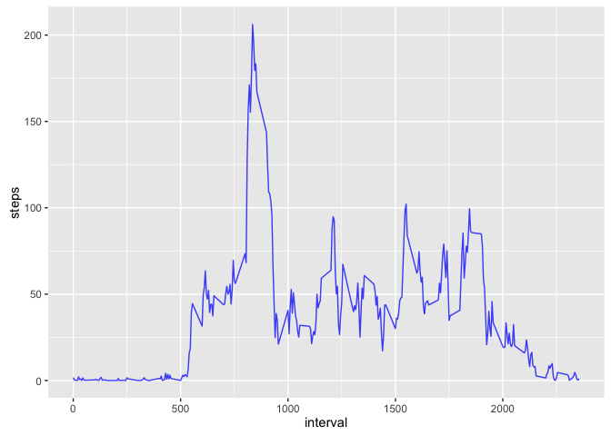
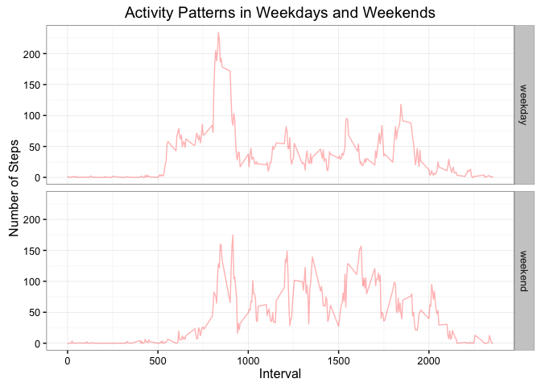

# Reproducible Research: Peer Assessment 1


## Loading and preprocessing the data
Since the data file (activity.zip) is available in the repository, we will create the dataset statring from the .csv file that is inside
(if not present), furthermore, we will include the knitr library and the ggplo2 if necessary:


```r
## Setting up all code chunks according to the assignment specs
knitr::opts_chunk$set(
    eval = TRUE,
    echo = TRUE,
    tidy = TRUE,
    results = "markup",
    include = TRUE,
    message = FALSE,
    warning = FALSE,
    knitr.table.format = "markdown", 
    tidy.opts = list(width.cutoff = 80), 
    fig.align = "center", 
    fig.path = "figure/", 
    highlight = TRUE
)


if (!require(knitr)) {
    install.packages("knitr")
}
if (!require(ggplot2)) {
    install.packages("ggplot2")
}


library(knitr)
library(ggplot2)

if (!file.exists("activity.csv")) {
   unzip("activity.zip") 
} 
dataframe <- read.csv(file = "activity.csv")
options("scipen" = 10)
```

A quick look at the data frame

```r
head(dataframe)
```

```
##   steps       date interval
## 1    NA 2012-10-01        0
## 2    NA 2012-10-01        5
## 3    NA 2012-10-01       10
## 4    NA 2012-10-01       15
## 5    NA 2012-10-01       20
## 6    NA 2012-10-01       25
```


## What is mean total number of steps taken per day?

###Calculate the total number of steps taken per day
Let's start by grouping by date the dataframe by date and change the column names to more meaningful names


```r
dataframe$date <- as.Date(dataframe$date)
aggregatedSteps <- aggregate(dataframe$steps, by = list(dataframe$date), sum)
colnames(aggregatedSteps) <- c("date", "steps")
```

Again, a quick look at the new dataframe (aggregatedSteps)


```r
head(aggregatedSteps)
```

```
##         date steps
## 1 2012-10-01    NA
## 2 2012-10-02   126
## 3 2012-10-03 11352
## 4 2012-10-04 12116
## 5 2012-10-05 13294
## 6 2012-10-06 15420
```

Notice that, as stated in the assignment, we are not interested in the missing data (aka 'NA') for now.

###Make a histogram of the total number of steps taken each day
We choose to create histogram by using ggplot2 (see comments in the code):


```r
# create the basic object
histogram <- ggplot(data = aggregatedSteps, mapping = aes(x = steps))
# add the histogram behaviour
histogram <- histogram + geom_histogram(aes(steps), fill = "red", colour = "white", 
    alpha = 0.75)
# show the histogram itself
histogram
```


###Calculate and report the mean and median of the total number of steps taken per day
We can calculate mean and median via the following code (notice that we are explicitely ignoring the NA):

```r
meanSteps <- round(mean(aggregatedSteps$steps, na.rm = TRUE))
medianSteps <- round(median(aggregatedSteps$steps, na.rm = TRUE))
```

Values for the variables meanSteps and medianSteps are respectively __10766__ and __10765__.

## What is the average daily activity pattern?


###Make a time series plot of the 5-minute interval (x-axis) and the average number of steps taken, averaged across all days.

The plot will be done via using the ggplot2 library (as the histogram above), first of all, we need a new dataframe grouping by interval rather than date, we will have to take care of the missing values this time as there is at least one NA per interval across the days (so just aggregating the values would result in a column full of 'NA').


```r
aggregatedInterval <- aggregate(dataframe$steps, by = list(dataframe$interval), mean, 
    na.action = na.pass, na.rm = TRUE)
colnames(aggregatedInterval) <- c("interval", "steps")
```

The plot, as requested, is created by the code below


```r
plot <- ggplot(data = aggregatedInterval, mapping = aes(x = interval, y = steps))
plot <- plot + geom_line(size = 0.5, colour = "blue", alpha = 0.75)
plot
```



###Which 5-minute interval, on average across all the days in the dataset, contains the maximum number of steps?

Code below will select the row having the higher amount of steps


```r
maxSteps <- aggregatedInterval[which.max(aggregatedInterval$steps), ]
```

The interval containing the maximum amount of steps is __835__, the number of steps for this interval is __206__.

## Imputing missing values
First of all, let's count the number of NAs:


```r
na_steps <- sum(is.na(aggregatedSteps$steps))
na_date <- sum(is.na(dataframe$date))
```

Results are presented  below:

na_steps:__8__
na_date:__0__

Having to deal with the NAs of the steps column (and only in this one), we choose the (simple) strategy to input the overall mean in the step column of the dataframe itself:


```r
aggregatedSteps[is.na(aggregatedSteps)] <- meanSteps
```

A quick look at the dataframe:


```r
head(aggregatedSteps)
```

```
##         date steps
## 1 2012-10-01 10766
## 2 2012-10-02   126
## 3 2012-10-03 11352
## 4 2012-10-04 12116
## 5 2012-10-05 13294
## 6 2012-10-06 15420
```

This confirms that the dataframe does not contain any more NAs (at least forr)

We can now proceed in re-creating the histogram (we can re-use the variables already defined):


```r
aggregatedSteps <- aggregate(dataframe$steps, by = list(dataframe$date), sum)
colnames(aggregatedSteps) <- c("date", "steps")
histogram <- ggplot(data = aggregatedSteps, mapping = aes(x = steps))
histogram <- histogram + geom_histogram(aes(steps), fill = "red", colour = "white", 
    alpha = 0.75)
histogram
```


Calculating the mean and median of the dataset (we expect them to don't change due to the strategy we implemented to fill the NAs):


```r
meanCleanSteps <- round(mean(aggregatedSteps$steps, na.rm = TRUE))
medianCleanSteps <- round(median(aggregatedSteps$steps, na.rm = TRUE))
```

Values for the variables meanSteps and medianSteps are respectively __10766__ and __10765__.

## Are there differences in activity patterns between weekdays and weekends?
Let's start by adding the 'week-day feature' on the original dataframe by using the suggested function:


```r
dataframe$weekday = weekdays(dataframe$date)
```

We can now easily proceed in adding the week-end one as requested: we choose to use a numeric feature and to map the value 1 to weekend and 0 otherwise:


```r
dataframe$weekend = ifelse(weekdays(dataframe$date) %in% c("Sunday", "Saturday"), 
    "weekend", "weekday")
```

A quick glance at the dataframe:


```r
head(dataframe)
```

```
##   steps       date interval weekday weekend
## 1    NA 2012-10-01        0  Monday weekday
## 2    NA 2012-10-01        5  Monday weekday
## 3    NA 2012-10-01       10  Monday weekday
## 4    NA 2012-10-01       15  Monday weekday
## 5    NA 2012-10-01       20  Monday weekday
## 6    NA 2012-10-01       25  Monday weekday
```

We can now proceed in making a new aggregation keeping into account the day of the week (Weekend vs Workday) and adjusting columns' names accordingly:


```r
aggregatedDataOverWeekEndVsWorkDay <- aggregate(dataframe$steps, by = list(dataframe$interval, 
    dataframe$weekend), mean, na.action = na.pass, na.rm = TRUE)
colnames(aggregatedDataOverWeekEndVsWorkDay) <- c("interval", "weekend", "steps")
```

Now we can create the graph with the two facets and a simple function to label them):


```r
ggplot(data = aggregatedDataOverWeekEndVsWorkDay, mapping = aes(x = interval, y = steps)) + 
    geom_line(colour = "red", alpha = 0.3) + facet_grid(weekend ~ .) + ggtitle(list(title = "Activity Patterns in Weekdays and Weekends", 
    y = "Number of Steps", x = "Interval")) + theme_bw()
```



The pattern seems a bit more substained during the weekdays, with a slower start during the weekend.

Maximum amount of steps is also higher in the weekdays all tho is more or less in the same interval as the one in the week end

